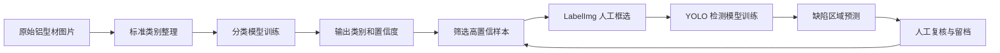
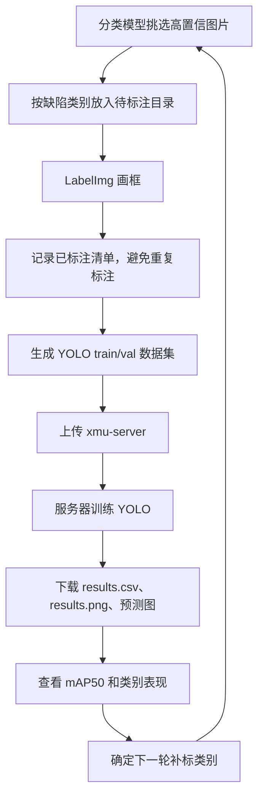
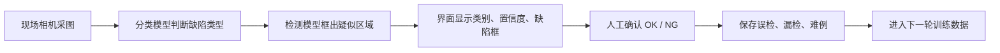
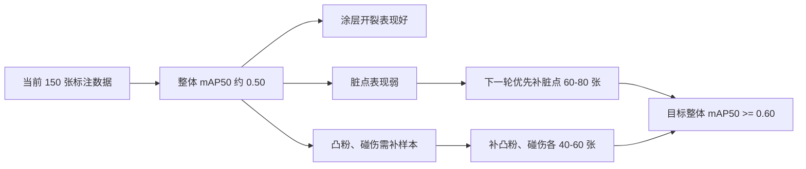

# 项目流程图

## 总体技术路线

```mermaid
flowchart LR
    A["原始铝型材图片"] --> B["标准类别整理"]
    B --> C["分类模型训练"]
    C --> D["输出类别和置信度"]
    D --> E["筛选高置信样本"]
    E --> F["LabelImg 人工框选"]
    F --> G["YOLO 检测模型训练"]
    G --> H["缺陷区域预测"]
    H --> I["人工复核与留档"]
    I --> E
```

## 阶段三标注与训练闭环

```mermaid
flowchart TD
    A["分类模型挑选高置信图片"] --> B["按缺陷类别放入待标注目录"]
    B --> C["LabelImg 画框"]
    C --> D["记录已标注清单，避免重复标注"]
    D --> E["生成 YOLO train/val 数据集"]
    E --> F["上传 xmu-server"]
    F --> G["服务器训练 YOLO"]
    G --> H["下载 results.csv、results.png、预测图"]
    H --> I["查看 mAP50 和类别表现"]
    I --> J["确定下一轮补标类别"]
    J --> A
```

## 现场推理流程

```mermaid
flowchart LR
    A["现场相机采图"] --> B["分类模型判断缺陷类型"]
    B --> C["检测模型框出疑似区域"]
    C --> D["界面显示类别、置信度、缺陷框"]
    D --> E["人工确认 OK / NG"]
    E --> F["保存误检、漏检、难例"]
    F --> G["进入下一轮训练数据"]
```

## 当前结果到下一轮目标

```mermaid
flowchart LR
    A["当前 150 张标注数据"] --> B["整体 mAP50 约 0.50"]
    B --> C["涂层开裂表现好"]
    B --> D["脏点表现弱"]
    B --> E["凸粉、碰伤需补样本"]
    D --> F["下一轮优先补脏点 60-80 张"]
    E --> G["补凸粉、碰伤各 40-60 张"]
    F --> H["目标整体 mAP50 >= 0.60"]
    G --> H
```

