# 铝型材缺陷图片人工复核要求书

## 一、复核目的

本次人工复核用于检查模型判断结果，重点找出漏检、误检、低置信度图片，以及未分类图片中模型判断为正常的候选图片。

最重要目标：少漏检。也就是宁可多提示人工看，也不要把明显缺陷当成正常放过。

## 二、图片提供与复核要求

1. 请提供正常铝型材图片和不良铝型材图片。
2. 图片不要加红框、红字、箭头、水印或截图标注。
3. 每种常见铝型材形状都请提供一些样本。
4. 尽量固定拍摄角度、距离、光源和背景。
5. 不良图片中缺陷位置要清晰可见，包括擦伤、拉伤、夹渣、滴脏、破损等。
6. 每种形状建议先提供正常图 800 到 1000 张、不良图 200 到 300 张。
7. 如果有现场相机或工位，请尽量用未来实际检测位置拍摄，不要只用手机随手拍。
8. 如果图片缺陷不明显，请在文件名中写明缺陷位置，例如：左上角擦花、右侧脏点、中间碰伤。

## 三、人工复核后请这样分类

请把人工确认后的图片放入下面这些中文文件夹：

```text
人工复核结果/
  00_正常/
  01_不导电/
  02_擦花/
  03_横条压凹/
  04_桔皮/
  05_漏底/
  06_碰伤/
  07_起坑/
  08_凸粉/
  09_涂层开裂/
  10_脏点/
  11_混合缺陷/
  12_不确定/
  13_坏图或无效图/
  14_原标签疑似错误/
```

如果一张图片同时有两种或多种缺陷，请放入 `11_混合缺陷`。如果看不清、无法确定，请放入 `12_不确定`。

## 四、11 种类别特征图和说明

### 00_正常

表面整体均匀，没有明显划伤、凹坑、脏污、掉漆、开裂等异常。

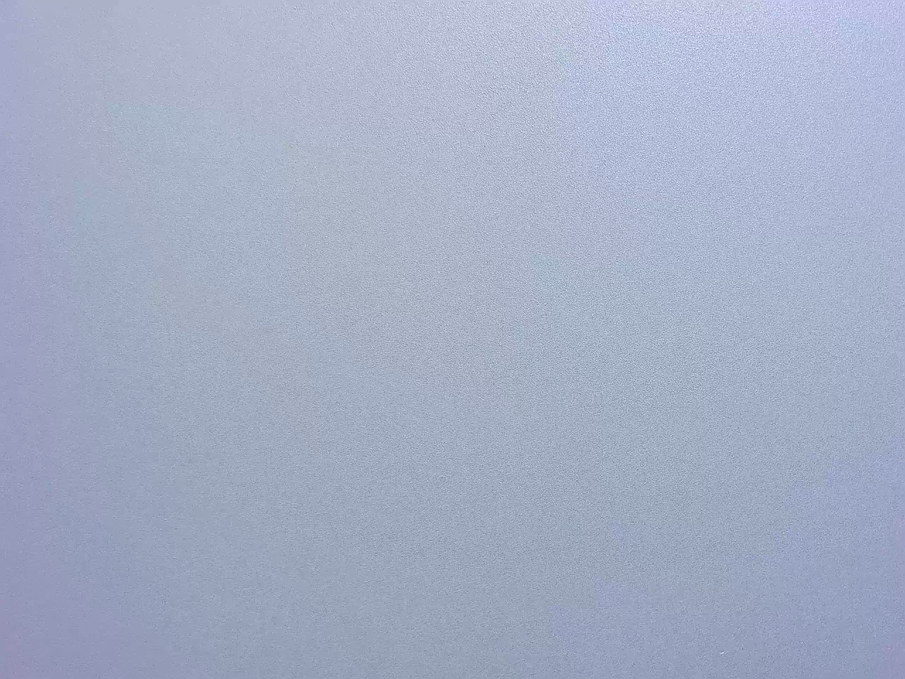

### 01_不导电

表面处理或导电性能相关异常，外观可能不明显，现场无法确认时放入不确定。

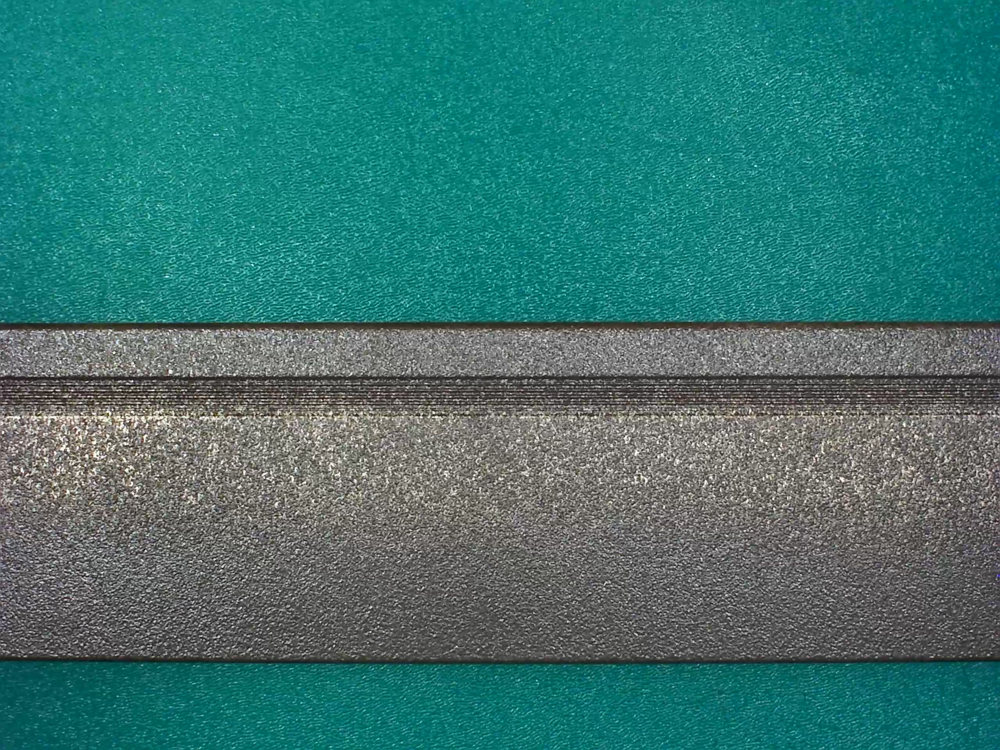

### 02_擦花

表面有线状、片状摩擦痕、拉伤、刮擦痕，常与脏点、凸粉混淆。

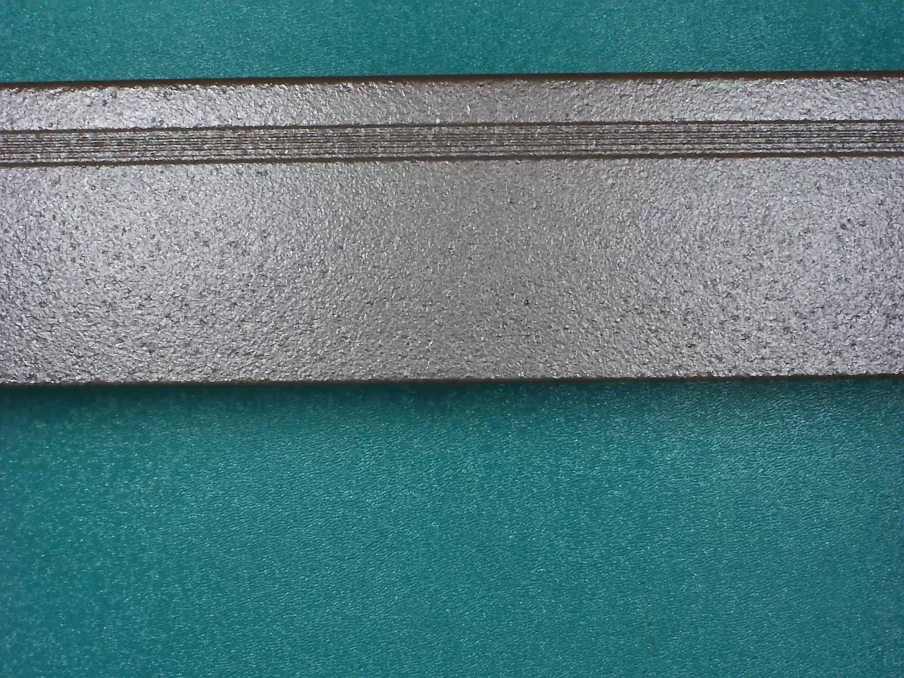

### 03_横条压凹

表面出现横向条纹、压痕、凹陷，通常呈横向或规则带状。

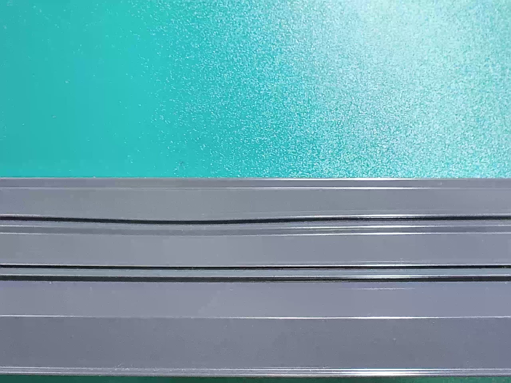

### 04_桔皮

表面纹理不均匀，类似橘皮颗粒纹，常与漏底、正常纹理混淆。

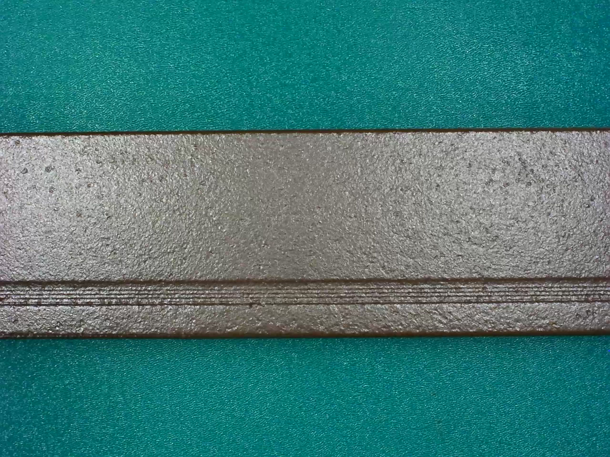

### 05_漏底

涂层或表面覆盖不足，露出底层或出现明显颜色差异。

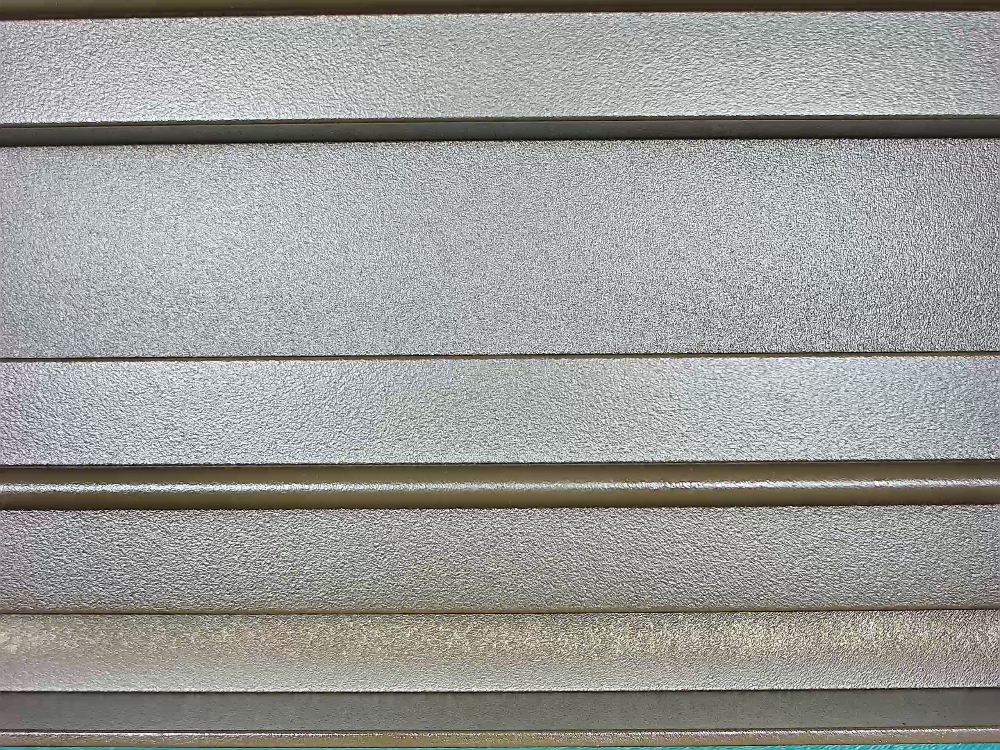

### 06_碰伤

撞击、磕碰、挤压造成局部破损、凹坑、变形。

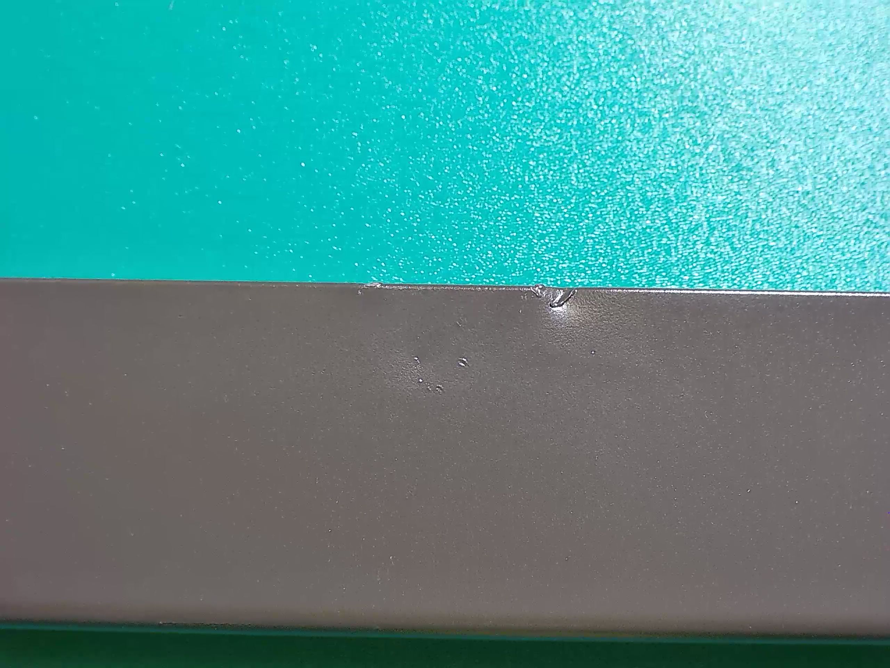

### 07_起坑

表面出现坑点、凹点、局部点状异常，常与碰伤、凸粉混淆。

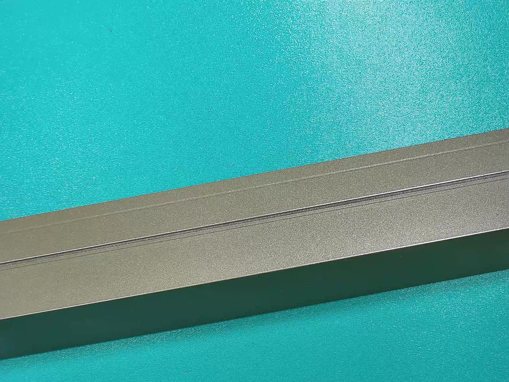

### 08_凸粉

表面有凸起粉点、颗粒、小白点或颗粒状异常。

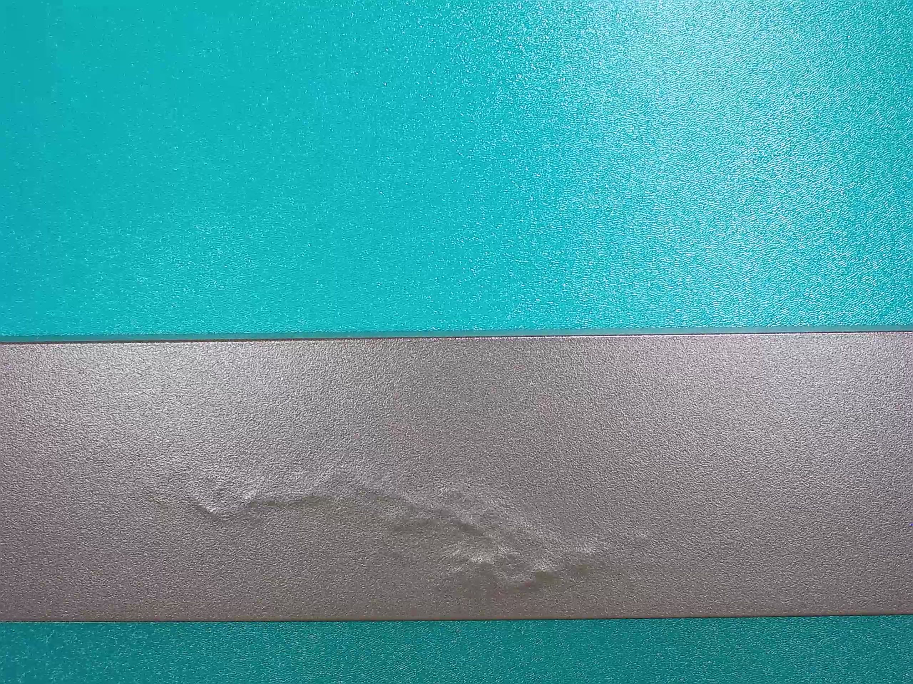

### 09_涂层开裂

涂层出现裂纹、断裂、开裂纹理，常与擦花或横条压凹混淆。

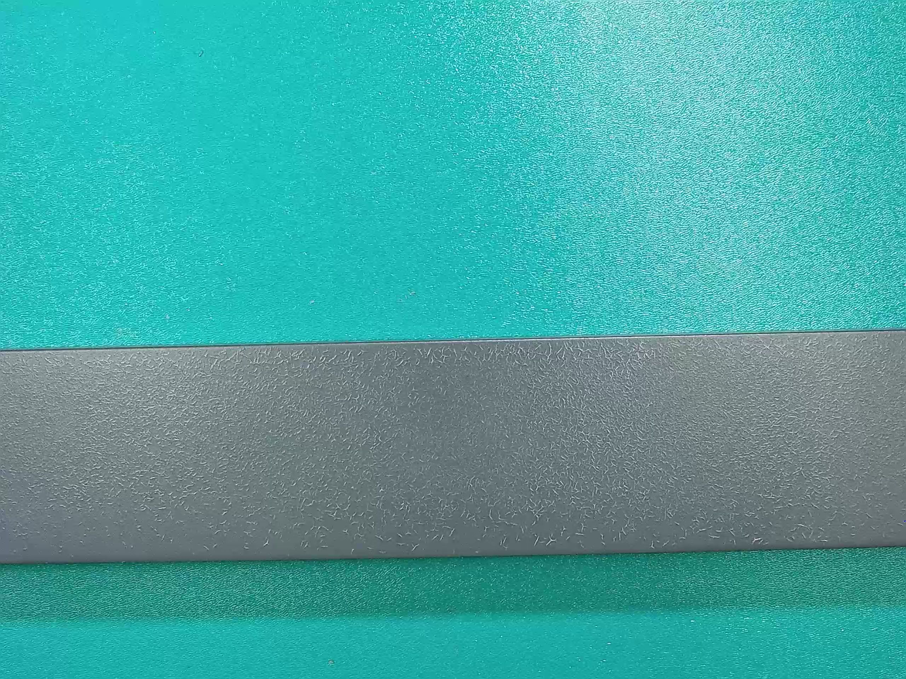

### 10_脏点

黑点、污点、杂质点、污染痕迹，常与擦花、凸粉、碰伤混淆。

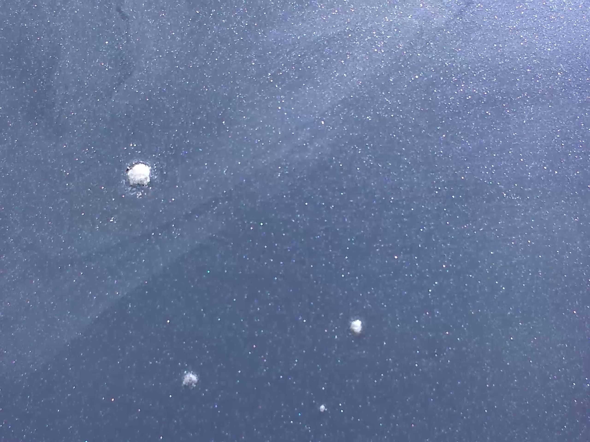

## 五、优先复核哪些图片

优先级从高到低：

1. `未分类图片复核/01_模型判正常_必须人工确认`：模型认为正常，但必须人工确认。
2. `已标注图片复核/01_缺陷判正常_优先看`：模型把缺陷判成正常，最容易造成漏检。
3. `已标注图片复核/03_四类重点错分_擦花碰伤凸粉脏点`：擦花、碰伤、凸粉、脏点这四类容易混淆。
4. `Top1Top3辅助复核/低置信度`：模型自己也不确定。
5. `Top1Top3辅助复核/Top1和Top2接近`：模型第一选择和第二选择很接近，容易判断错。

## 六、文件名怎么看

输出图片文件名里会写明模型判断信息，例如：

```text
真实_02_擦花__预测_10_脏点__源图_xxx__置信度_0.642__前二差值_0.051.jpg
```

含义：这张图原标签是擦花，模型判断为脏点，置信度 0.642，前两名差值 0.051。差值越小，说明模型越犹豫。

人工复核时不要直接相信模型结果，以图片真实内容为准。

## 七、复核完成后返回什么

请返回整个 `人工复核结果` 文件夹，并保留本次复核包中的 `复核索引.csv`，方便后续把人工结果回写到训练数据中。
