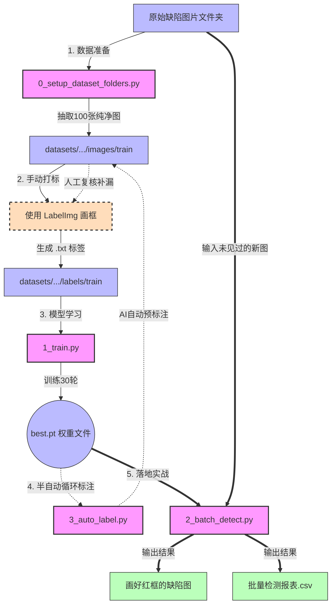

# 铝型材/钢材表面缺陷检测 - AI MVP 版本运行流程

这份文档记录了本项目当前的闭环检测流程，从数据抽取到最终的批量检测，所有操作均在 `src` 文件夹下执行相应的 Python 脚本。

## ⚙️ 核心流程图

---

## 📝 步骤详解与使用说明

### 第一步：初始化数据集 (抽题)
- **脚本**: `0_setup_dataset_folders.py`
- **作用**: 自动创建 YOLO 标准的文件夹格式，并从你的总图库中随机抽取 100 张图片放入 `train` 文件夹。
- **使用时机**: 建立新项目，或者想重新从图库里抽取一批新图进行标注时使用。

### 第二步：人工预标注 (教学)
- **工具**: 命令行输入 `labelImg`
- **作用**: 人工查看 `train` 文件夹内的图片，把真正的缺陷画上矩形框并命名为 `defect`。不用全标，标个 20~50 张即可。

### 第三步：AI 模型训练 (炼丹)
- **脚本**: `1_train.py`
- **作用**: 读取你刚才画的框，让 AI 寻找这些缺陷和正常粗糙背景的差异。训练完成后，会在 `src/runs` 目录下生成最新的 `best.pt` 脑瓜子（模型权重）。
- **说明**: 代码已支持自动识别设备 `device=None`，如果你有 NVIDIA 显卡环境，它会自动开启 GPU 狂飙模式。

### 第四步：AI 辅助自动标注 (滚雪球)
- **脚本**: `3_auto_label.py`
- **作用**: 用刚才训练出来的模型，去帮你把 `train` 文件夹里**还没标过的图片**全自动画上框。
- **用法**: 运行后，你再次打开 `labelImg` 进去当“监工”，看看 AI 标得对不对，稍微修修补补，然后**再次运行 `1_train.py`** 重新训练，模型就会越来越强！

### 第五步：全图库批量实战检测 (毕业考试)
- **脚本**: `2_batch_detect.py`
- **作用**: 彻底脱离训练阶段，直接拿训练好的模型去扫描成百上千张全新的原始图片。
- **输出**: 在主目录下生成 `检测结果输出` 文件夹，里面包含：
  1. 每一张图哪里有缺陷的**画框渲染图**。
  2. 一份精准的 **Excel/CSV 数据报表**（记录了 NG/OK、缺陷数量、坐标、置信度）。
